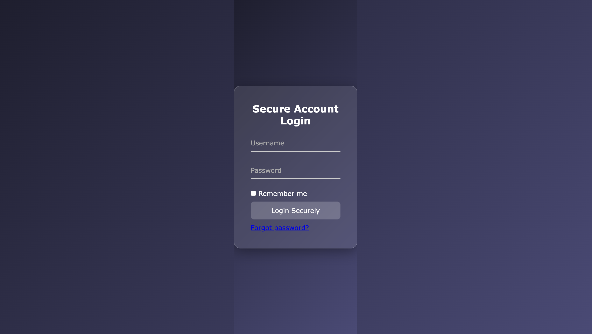

<div align="center">

# 🔐 Modern Login Form

### A clean, responsive and modern Login Form built using HTML, CSS & JavaScript

A beautiful authentication UI featuring a responsive layout, modern styling, smooth interactions, and client-side form validation.


</div>

---

# 🌐 Live Demo

👉 https://manikgupta-2004.github.io/login-form/

---

# 📸 Project Preview

<p align="center">
  
</p>

---

# 📖 About The Project

This project is a modern and fully responsive Login Form developed using HTML5, CSS3, and JavaScript.

The application focuses on delivering a clean user interface with responsive design principles and client-side form validation to enhance user experience.

It demonstrates modern frontend development practices while maintaining simplicity, accessibility, and performance.

---

# ✨ Features

- 🔐 Modern Login Interface
- 📱 Fully Responsive Design
- ⚡ Client-side Form Validation
- 🎨 Attractive UI Design
- 🖱 Interactive Buttons & Inputs
- 💻 Cross-Browser Compatible
- 🚀 Fast Loading
- 🧹 Clean & Organized Code

---

# 🛠 Tech Stack

- HTML5
- CSS3
- JavaScript (ES6)

---

# 📂 Project Structure

```
login-form/
│
├── index.html
├── style.css
├── script.js
├── screenshot.png
└── README.md
```

---

# 🚀 Getting Started

Clone the repository

```bash
git clone https://github.com/manikgupta-2004/login-form.git
```

Open

```text
index.html
```

in your preferred web browser.

---

# 📚 What I Learned

- Responsive Web Design
- Form Validation
- DOM Manipulation
- Event Handling
- Modern CSS Layouts
- User Interface Design
- JavaScript Fundamentals

---

# 🎯 Future Improvements

- 👁 Show / Hide Password
- 🔒 Password Strength Indicator
- 📧 Email Verification
- 🌙 Dark Mode
- 🔑 Remember Me Functionality
- 🔐 Backend Authentication Integration

---

# 👨‍💻 Author

**Manik Gupta**

Frontend Developer | JavaScript Enthusiast

GitHub:
https://github.com/manikgupta-2004

---

<div align="center">

### ⭐ If you found this project useful, consider giving it a Star!

</div>
